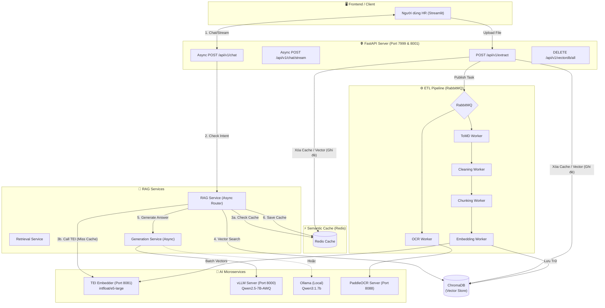

# Hệ thống RAG Server-Grade: Chatbot nội bộ CT-Group

Hệ thống RAG (Retrieval-Augmented Generation) chuyên biệt dành cho tài liệu nhân sự nội bộ, được kiến trúc theo tiêu chuẩn Server-Grade Microservices. Điểm nhấn của hệ thống là khả năng mở rộng linh hoạt, tách biệt hoàn toàn giữa quá trình trích xuất dữ liệu (ETL Pipeline) và truy vấn thời gian thực (Chatbot RAG), cùng với cơ chế Caching và Bất đồng bộ (Async) mạnh mẽ.

---

## 🏗️ Kiến Trúc Hệ Thống Hiện Tại (Microservices)

Hệ thống hiện tại được chia làm 2 cụm chính: **ETL Pipeline** (Xử lý dữ liệu) và **Chatbot RAG** (Phản hồi người dùng). Các Microservices được liên kết chặt chẽ qua Message Queue (RabbitMQ), HTTP APIs và Caching (Redis).

### Sơ đồ Kiến Trúc Mới Nhất



---

## 🛠️ Phân Tích Các Thành Phần Cốt Lõi

1. **Semantic Cache (Redis):** Thay vì phải chạy lại Embedding và sinh text bằng LLM cho các câu hỏi trùng lặp, Semantic Cache lưu lại Vector của câu hỏi. Khi độ tương đồng (Cosine Similarity) > 95%, hệ thống sẽ móc câu trả lời từ Cache trả về lập tức (Độ trễ <50ms). Khi người dùng **Ghi đè File** hoặc **Xóa DB**, Cache sẽ tự động bị dọn dẹp để đảm bảo thông tin luôn mới nhất.

2. **TEI (Text Embeddings Inference):** Microservice siêu tốc của HuggingFace viết bằng Rust. Đứng ra gánh vác việc tạo Vector cho cả Chatbot và ETL Worker. Giúp giải phóng VRAM (do model không bị load 2 lần vào ứng dụng) và tăng tốc độ xử lý nhờ FlashAttention.

3. **Luồng Async Hoàn Toàn:** Từ Endpoint `/chat` cho đến khi gọi LLM client (`vllm_client.py`), mọi hàm đều là `async def`, `ainvoke`, `astream`. Giúp server đáp ứng hàng chục Request cùng lúc mà không bị nghẽn (Block).

---

## 🚀 Hướng Dẫn Khởi Chạy

Do đặc thù môi trường Local (máy tính cá nhân) và Production (Server lớn) khác nhau về mặt phần cứng (VRAM), hệ thống được cấu hình để chuyển đổi linh hoạt thông qua file `.env`.

### Phương Án 1: Chạy Local (Cho Dev / Máy cá nhân VRAM thấp)
Sử dụng **Ollama** làm backend LLM và chạy Embedding trực tiếp bằng thư viện `sentence-transformers` trên CPU/GPU cá nhân.

1. **Cấu hình `.env`:**
   ```env
   # Chọn provider là ollama
   LLM_PROVIDER=ollama
   MODEL_LLM=qwen3:1.7b
   
   # Tắt TEI nếu muốn chạy bằng thư viện nội bộ (Bằng cách xóa/comment dòng TEI đi)
   # Nếu bật TEI thì dùng: TEI_EMBEDDER_URL=http://localhost:8081
   # TEI_EMBEDDER_URL=http://localhost:8081
   
   # Redis cho Semantic Cache
   REDIS_HOST=localhost
   REDIS_PORT=6379
   ```

2. **Khởi động Local Docker (Database & Message Queue):**
   ```bash
   docker-compose up -d
   # Lệnh này sẽ bật: ChromaDB, RabbitMQ, Redis.
   ```

3. **Chạy Môi Trường Ảo & API:**
   ```bash
   .venv\Scripts\activate
   # Chạy Bot:
   uvicorn app.api_bot:app --host 0.0.0.0 --port 8000 --reload
   
   # Chạy ETL API:
   uvicorn app.api_etl:app --host 0.0.0.0 --port 8001 --reload
   ```

4. **Chạy Background Workers (Mở các terminal khác nhau):**
   ```bash
   python -m pipeline.workers.ocr_worker
   python -m pipeline.workers.chunking_worker
   python -m pipeline.workers.embedding_worker
   # ...
   ```

---

### Phương Án 2: Chạy Server Production (VRAM lớn)
Sử dụng **vLLM** làm backend LLM (hỗ trợ Continuous Batching) và dùng **TEI** làm Server Embedding. Mọi thứ được Container hóa 100%.

1. **Cấu hình `.env.server`:**
   ```env
   LLM_PROVIDER=vllm
   MODEL_LLM=Qwen/Qwen2.5-7B-Instruct-AWQ
   VLLM_BASE_URL=http://vllm:8000/v1
   
   # Dùng Microservice TEI chung mạng Docker
   TEI_EMBEDDER_URL=http://tei_embedder:80
   
   # Dùng Redis chung mạng Docker
   REDIS_HOST=redis_server
   REDIS_PORT=6379
   ```

2. **Khởi Động Toàn Hệ Thống Bằng Docker Compose Server:**
   ```bash
   # File docker-compose.server.yml chứa toàn bộ các service:
   # vLLM, TEI, Chatbot App, PaddleOCR, Chroma, RabbitMQ, Redis, Nginx...
   
   docker-compose -f docker-compose.server.yml up -d --build
   ```

Lúc này, bạn không cần phải chạy thủ công các Worker bằng lệnh `python -m...` nữa. File `Dockerfile.server` đã tích hợp `supervisord` để tự động khởi động và giám sát FastAPI cùng lúc với tất cả các Workers bên trong Container `chatbot_app`.

---

## 🔒 Cơ Chế An Toàn & Self-Healing
- **Ghi đè File (Force Update):** Khi upload file trùng tên, UI Streamlit sẽ hiện cảnh báo. Nếu User xác nhận, luồng API sẽ tự gọi hàm xóa chính xác các Vector của file cũ trong ChromaDB (theo `metadata`), đồng thời `Flush` toàn bộ Semantic Cache trong Redis để hệ thống không ảo giác với nội dung cũ.
- **Bypass RAG (Smart Router):** Bất kỳ câu hỏi vô nghĩa (Spam), hoặc chào hỏi (Chitchat) đều được bắt lại bằng Regex và Smart Router. Hệ thống trả lời ngay lập tức mà không cần chọc vào VectorDB hay kích hoạt luồng LLM phức tạp, đảm bảo không lãng phí token và tài nguyên Server.
