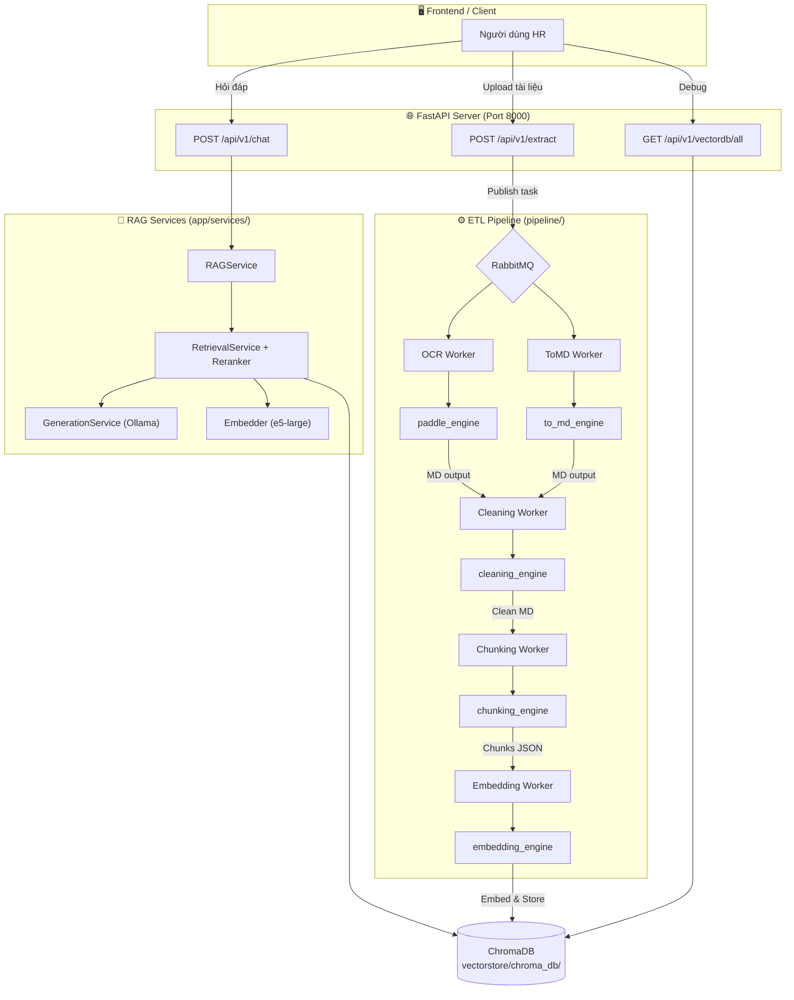

# Chatbot CT-Group (RAG-based)


---

## 🛠️ Công nghệ
- Backend: FastAPI  
- LLM: Ollama  
- Framework: LangChain  
- Vector DB: Chroma 
- Embedding: Sentence Transformers  

---

## ⚙️ Cài đặt: nhớ upgrade pip

```bash
git clone <Chatbot-CT-Group>
cd chatbot-ct-group

python -m venv .venv
.venv\Scripts\activate

pip install -r requirements-dev.txt

```
## Quy Trình Khởi Chạy Sau Tích Hợp

```powershell
# Bước 1: Khởi động Docker (PaddleOCR + RabbitMQ)
docker-compose up -d

# Bước 2: Chạy FastAPI Server (duy nhất 1 cổng)
uvicorn app.main:app --host 0.0.0.0 --port 8000 --reload

# Bước 3: Khởi động Workers (mỗi worker 1 terminal)
python -m pipeline.workers.ocr_worker
python -m pipeline.workers.to_md_worker
python -m pipeline.workers.cleaning_worker
python -m pipeline.workers.chunking_worker
python -m pipeline.workers.embedding_worker
```

**Endpoints có sẵn:**
| Method | Endpoint | Chức năng | Nguồn |
|---|---|---|---|
| POST | `/api/v1/chat` | Chat RAG | Chatbot |
| GET | `/api/v1/health` | Health check | Chatbot |
| POST | `/api/v1/extract` | Upload & auto-route ETL | XuLy |
| GET | `/api/v1/vectordb/all` | Debug VectorDB | XuLy |
| DELETE | `/api/v1/vectordb/all` | Clear VectorDB | XuLy |

---

## Lưu Đồ Luồng Dữ Liệu Sau Tích Hợp



---


