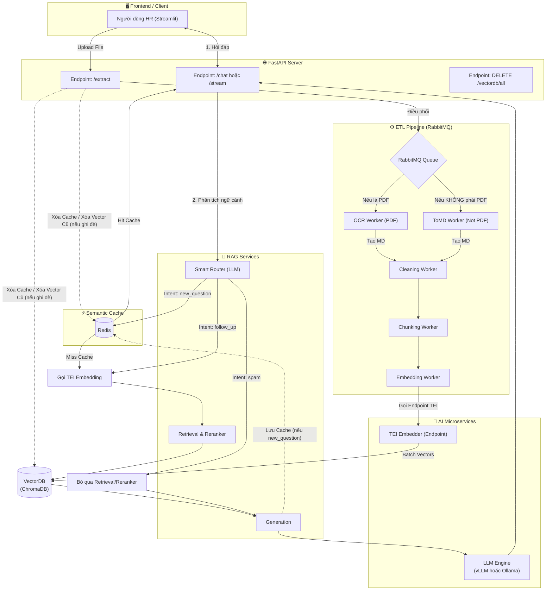

# Hệ thống RAG Server-Grade: Chatbot nội bộ CT-Group

Hệ thống RAG (Retrieval-Augmented Generation) chuyên biệt dành cho tài liệu nhân sự nội bộ, được kiến trúc theo tiêu chuẩn Server-Grade Microservices. Điểm nhấn của hệ thống là khả năng mở rộng linh hoạt, tách biệt hoàn toàn giữa quá trình trích xuất dữ liệu (ETL Pipeline) và truy vấn thời gian thực (Chatbot RAG), cùng với cơ chế Caching và Bất đồng bộ (Async) mạnh mẽ.

---

## 🏗️ Kiến Trúc Hệ Thống Hiện Tại (Microservices)

Hệ thống hiện tại được chia làm 2 cụm chính: **ETL Pipeline** (Xử lý dữ liệu) và **Chatbot RAG** (Phản hồi người dùng). Cả hai đều được thiết kế để sử dụng chung các dịch vụ lõi (như TEI Embedding, VectorDB) nhằm tiết kiệm tài nguyên.

### Sơ đồ Kiến Trúc



### 1. Luồng Hoạt Động Của ChatBot
Khi người dùng đặt câu hỏi:
1. Yêu cầu được gửi vào 1 trong 2 endpoint là `/stream` hoặc `/chat`.
2. **Smart Router (LLM)** sẽ phân tích câu hỏi để xác định ý định (Intent):
   - **Nếu là `new_question`:** Hệ thống kiểm tra Semantic Cache (Redis). 
     - Nếu có trong cache -> Trả luôn kết quả cho người dùng. 
     - Nếu chưa có -> Hệ thống gọi qua endpoint **TEI** để embedding câu hỏi -> Chạy qua Retrieval (Tìm kiếm VectorDB) và Reranker (Sắp xếp lại) -> Đưa ngữ cảnh vào LLM để sinh câu trả lời -> Trả kết quả cho người dùng và lưu vào Cache.
   - **Nếu là `follow_up`:** Bỏ qua bước check Cache. Hệ thống gọi ngay TEI để embedding -> Thực hiện full pipeline RAG (Retrieval, Reranker, LLM).
   - **Nếu là `spam`:** Hệ thống bỏ qua hoàn toàn phần Retrieval và Reranker. Câu hỏi được đưa thẳng vào LLM để LLM trả kết quả là "không có tài liệu" -> Trả kết quả lại cho người dùng.

### 2. Luồng Hoạt Động Của ETL (Nạp Dữ Liệu)
Khi quản trị viên Upload tài liệu mới:
1. Tài liệu được đưa vào Queue của **RabbitMQ** để điều phối.
2. Dựa trên định dạng file:
   - Nếu **không phải là PDF** (Word, Excel...) -> Đưa vào `to_md_worker`.
   - Nếu **là PDF** -> Đưa vào `ocr_worker`.
3. Sau khi file được chuyển đổi thành Markdown (.md) -> Đưa vào `cleaning_worker` để làm sạch văn bản.
4. Chuyển sang `chunking_worker` để băm nhỏ theo cơ chế tùy chỉnh.
5. Cuối cùng, `embedding_worker` tiếp nhận các chunks -> Gọi vào **Endpoint TEI** để chuyển thành Vector -> Lưu vào **VectorDB** (ChromaDB).

### 3. Các Cơ Chế An Toàn Khi Upload File
Để đảm bảo tính nhất quán của dữ liệu, hệ thống tự động xử lý các tình huống xung đột:
- **Khi xóa toàn bộ dữ liệu (Wipe DB):** Hệ thống không chỉ xóa Vector trong ChromaDB mà còn **xóa luôn file `file_registry.json`** (lịch sử nạp file) để tránh lỗi trùng lặp ảo, và đặc biệt là **xóa luôn toàn bộ Semantic Cache** trong Redis để LLM không bị "ảo giác" do nhớ nhầm kiến thức cũ.
- **Khi nạp một file đã tồn tại:** Hệ thống sẽ chặn lại và hỏi xác nhận trên giao diện: *Bạn đang muốn update kiến thức hay là bạn nhầm lẫn?*
  - Nếu chọn Update Kiến Thức -> Hệ thống sẽ **xóa toàn bộ data trong VectorDB** của `filename` đó, đồng thời **xóa Cache**, sau đó tiến hành nạp file mới vào hệ thống.
  - Nếu Không -> Hệ thống báo lỗi là bạn trùng file và dừng lại.

---

## 🚀 Hướng Dẫn Khởi Chạy

Do đặc thù môi trường Local (máy tính cá nhân) và Production (Server lớn) khác nhau về mặt phần cứng (VRAM), hệ thống được cấu hình để chuyển đổi linh hoạt thông qua file môi trường `.env`.

### Phương Án 1: Chạy Local (Cho Dev / Máy cá nhân)
Sử dụng **Ollama** làm backend LLM và chạy trực tiếp.

1. **Cấu hình `.env`:**
   ```env
   # Chọn provider là ollama
   LLM_PROVIDER=ollama
   MODEL_LLM=qwen3:1.7b # Có thể đổi sang model lớn hơn tuỳ VRAM
   
   # Tắt TEI nếu muốn chạy bằng thư viện nội bộ (Bằng cách xóa/comment dòng TEI đi)
   # Nếu muốn bật TEI ở Local thì dùng: TEI_EMBEDDER_URL=http://localhost:8081
   
   # Redis cho Semantic Cache
   REDIS_HOST=localhost
   REDIS_PORT=6379
   ```

2. **Khởi động Local Docker (Database & Message Queue):**
   ```bash
   docker-compose up -d
   # Lệnh này sẽ bật: ChromaDB, RabbitMQ, Redis.
   ```

3. **Chạy Môi Trường Ảo & API:**
   ```bash
   .venv\Scripts\activate
   # Chạy Bot:
   uvicorn app.api_bot:app --host 0.0.0.0 --port 8000 --reload
   
   # Chạy ETL API:
   uvicorn app.api_etl:app --host 0.0.0.0 --port 8001 --reload
   ```

4. **Chạy Background Workers (Mở các terminal khác nhau):**
   ```bash
   python -m pipeline.workers.ocr_worker
   python -m pipeline.workers.to_md_worker
   python -m pipeline.workers.cleaning_worker
   python -m pipeline.workers.chunking_worker
   python -m pipeline.workers.embedding_worker
   # Chạy đầy đủ các worker tham gia vào luồng
   ```

---

### Phương Án 2: Chạy Server Production
Sử dụng **vLLM** làm backend LLM (tối ưu thông lượng lớn) và dùng **TEI** làm Microservice Embedding. Mọi thứ được Container hóa 100%.

1. **Cấu hình `.env.server`:**
   ```env
   LLM_PROVIDER=vllm
   MODEL_LLM=Qwen/Qwen2.5-7B-Instruct-AWQ
   VLLM_BASE_URL=http://vllm:8000/v1
   
   # Kết nối Microservice TEI chung mạng Docker
   TEI_EMBEDDER_URL=http://tei_embedder:80
   
   # Kết nối Redis chung mạng Docker
   REDIS_HOST=redis_server
   REDIS_PORT=6379
   ```

2. **Kiểm soát VRAM cho vLLM:**
   Nếu VRAM bị giới hạn, trong file `docker-compose.server.yml`, điều chỉnh cấu hình của vLLM để tránh lỗi Out-Of-Memory. Ví dụ:
   ```yaml
   command: >
     --model Qwen/Qwen2.5-7B-Instruct-AWQ
     --max-model-len 10240
     --gpu-memory-utilization 0.45 
     --max-num-seqs 8
   ```

3. **Khởi Động Toàn Hệ Thống Bằng Docker Compose Server:**
   ```bash
   # Dừng toàn bộ hệ thống 
   docker compose -f docker-compose.server.yml down
      
   # Build và khởi động toàn bộ hệ thống
   docker-compose -f docker-compose.server.yml up -d --build
   ```

Lúc này, bạn không cần phải chạy thủ công các Worker bằng lệnh `python -m...` nữa. File `Dockerfile.server` đã tích hợp `supervisord` để tự động khởi động và giám sát FastAPI cùng lúc với tất cả các Workers bên trong Container `chatbot_app`. Toàn bộ luồng từ ETL đến Chatbot sẽ chạy ngầm và giao tiếp qua RabbitMQ và Redis hoàn toàn tự động.

### 4. Xem Log Hệ Thống (Monitoring)
Để theo dõi quá trình hoạt động của các dịch vụ đang chạy ngầm trên Server, bạn có thể sử dụng các lệnh Docker sau:

```bash

# Xem log của toàn bộ hệ thống (cuộn liên tục theo thời gian thực)
docker-compose -f docker-compose.server.yml logs -f

# Xem log riêng nhưng phần quan trong nhất 
docker compose -f docker-compose.server.yml logs -f chatbot_app vllm tei_embedder redis_server

# Xem log riêng của App chính (Hiển thị luồng Chatbot, Intent, RAG và các Workers)
docker logs -f chatbot_app

# Xem log riêng của LLM Engine (vLLM) để theo dõi tốc độ token và kiểm tra VRAM
docker logs -f vllm

# Xem log của TEI Embedder để kiểm tra tốc độ ép kiểu Vector
docker logs -f tei_embedder
```
