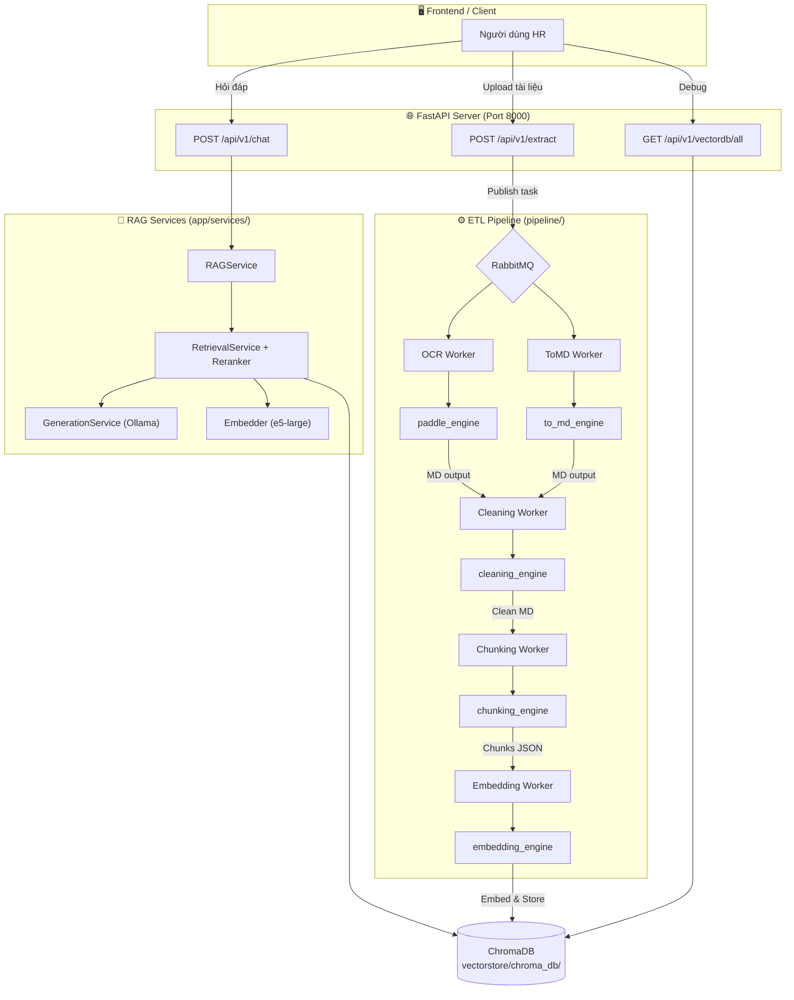

# Chatbot CT-Group (RAG-based)


---

## 🛠️ Công nghệ
- Backend: FastAPI  
- LLM: Ollama  
- Framework: LangChain  
- Vector DB: Chroma 
- Embedding: Sentence Transformers  

---

## ⚙️ Cài đặt: nhớ upgrade pip

```bash
git clone <Chatbot-CT-Group>
cd chatbot-ct-group

python -m venv .venv
.venv\Scripts\activate

pip install -r requirements-dev.txt

```
## Quy Trình Khởi Chạy (Chống Tràn VRAM)

Lưu ý: Vì máy cá nhân (RTX 3050 - 4GB) bị nghẽn VRAM nếu khởi chạy toàn bộ Hệ thống, API Backend **đã được tách luồng.** Tùy nhu cầu lúc nào xử lý dữ liệu thì chạy Tầng ETL, lúc nào User chat thì chạy Tầng Bot.

```powershell
# Bước 1: Khởi động Docker (PaddleOCR + RabbitMQ)
docker-compose up -d

# Bước 2: Activate môi trường ảo (Áp dụng cho mọi terminal bạn mở)
.\.venv\Scripts\Activate.ps1

# ==============================================================
# HƯỚNG DẪN 1: KHI CẦN NẠP DỮ LIỆU MỚI VÀO DATABASE (ETL)
# ==============================================================
# Chạy API thu thập tài liệu (chạy trên port 8001):
uvicorn app.api_etl:app --host 0.0.0.0 --port 8001 --reload
# (Sau đó chạy tuần tự từng worker bên dưới CÙNG LÚC, mỗi dòng lệnh 1 cửa sổ terminal mới)
python -m pipeline.workers.ocr_worker
python -m pipeline.workers.to_md_worker
python -m pipeline.workers.cleaning_worker
python -m pipeline.workers.chunking_worker
python -m pipeline.workers.embedding_worker

# ==============================================================
# HƯỚNG DẪN 2: KHI CẦN CHẠY CHATBOT ĐỂ TRẢ LỜI NGƯỜI DÙNG
# ==============================================================
# *Tắt hẳn API ETL và các workers ở trên để dọn sạch VRAM (Ctrl+C hoặc tắt cửa sổ).*
# Bật API Chatbot chuyên dụng (chạy trên port 8000):
uvicorn app.api_bot:app --host 0.0.0.0 --port 8000 --reload
```

**Danh sách Endpoints (Đã phân lớp):**
| Mảng | Method | Endpoint | Port Phụ Trách | Chức năng |
|---|---|---|---|---|
| Chatbot | POST | `/api/v1/chat` | `:8000` | Giao tiếp Chat RAG |
| Chatbot | GET | `/api/v1/health` | `:8000` | Kiểm tra Bot |
| Data | POST | `/api/v1/extract` | `:8001` | Upload văn bản thô |
| Data | GET | `/api/v1/vectordb/all` | `:8001` | Kiểm tra VectorDB|
| Data | DELETE | `/api/v1/vectordb/all` | `:8001` | Clear VectorDB |

---

## Lưu Đồ Luồng Dữ Liệu Sau Tích Hợp



---


