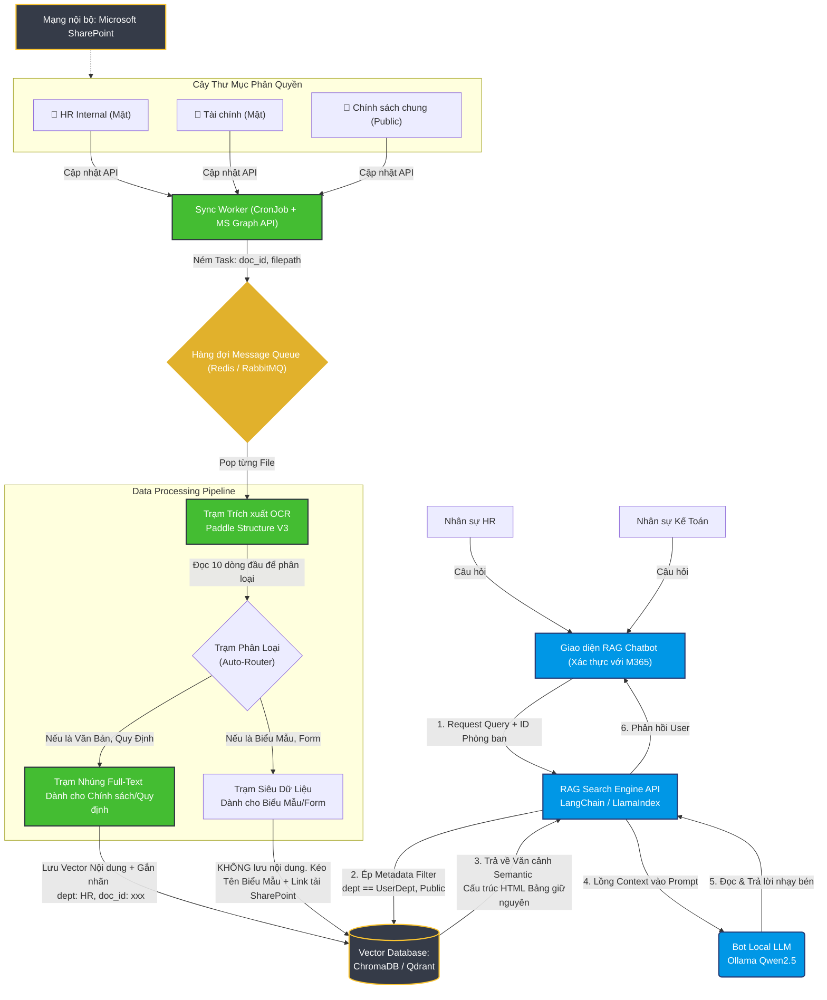

# KẾ HOẠCH KIẾN TRÚC TỔNG THỂ (MASTER ARCHITECTURE)
**Dự Án:** Enterprise RAG Chatbot with RBAC & SharePoint Sync
**Mục tiêu:** Xây dựng hệ thống tự động đồng bộ tài liệu, chống tràn bộ nhớ đa phiên kết nối và bảo mật truy cập phân quyền theo phòng ban.

---

## 1. SƠ ĐỒ LUỒNG KIẾN TRÚC (MERMAID DIAGRAM)
*Hãy mở tệp này bằng bộ đọc Markdown trên VSCode/Obsidian hoặc dán lên GitHub để thấy toàn cảnh rực rỡ của sơ đồ.*

---

## 2. DIỄN GIẢI CHỨC NĂNG CÁC TRẠM

### Trạm Đệm Giảm Tải (Message Queue - Màu Vàng)
Đây là "người hùng" sửa lỗi sập hệ thống (OOM). Khi ném hàng trăm folder vào, Worker tạo ra 1000 Tasks. Thay vì PaddleOCR ép bản thân phải xử lý cùng 1000 cái (dẫn đến sập Cuda/VRAM), Queue bắt OCR phải làm theo thứ tự xếp hàng (Pop/Push). Giảm tải áp lực hệ thống trạm Local PC hoàn hảo.

### Trạm Cắt & Gắn Thẻ Phân Quyền (Embedding Worker)
Mọi Chunk text đi ra từ Markdown của Paddle đều không được nạp "trần trụi" vào ChromaDB. Chúng phải được **đóng dấu giáp lai (Metadata)**.
Ví dụ: `chunk_text: "Quy định mức Thưởng tết...", metadata: {"department": "HR", "access": "Confidential", "doc_id": "File_01"}`

### Trạm Truy vấn An toàn (RAG Search Engine)
Hệ API này sẽ can thiệp vào tầng Tìm Kiếm. 
Nếu ông A thuộc phòng Kế Toán tra cứu: Câu lệnh Vector DB sẽ bị "kẹp gông" một Filter: Tìm ý nghĩa tương đồng NHƯNG `metadata.department` BẮT BUỘC bằng `"KeToan"` hoặc `"Public"`.
Nó vĩnh viễn khóa đường vào của phòng Nhân Sự đối với ông Kế Toán này. Vừa giữ bảo mật đa phòng ban, vừa rút ngắn vòng quét Semantic.

## 3. KHUYẾN NGHỊ DEPLOYMENT DOCKER-COMPOSE
Trong Docker Compose tương lai của bạn, sẽ có 4 khối Services sau (Gắn chung 1 Bridge Network):
1. Khối `paddle_ocr`: Core như mình đang làm (Mở API chạy ngầm).
2. Khối `rag_server`: Bọc Source Code tìm kiếm API, Authentication, và kết nối Sharepoint.
3. Khối `vector_db`: Container chạy ChromaDB/Qdrant. 
4. Khối `redis`: Làm bãi đáp Message Queue xếp hàng nộp tài liệu.
